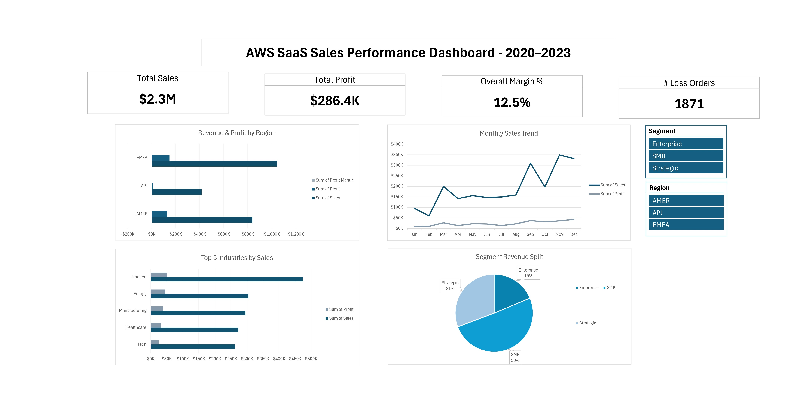

# AWS SaaS Sales Analysis
### Excel + Power Query · Tableau Public

**By Jasmine Unochi** · [LinkedIn](https://www.linkedin.com/in/jasmine-unochi-4613a3169) · [GitHub](https://github.com/unochifarah)

---

## Overview

This project analyzes 9,993 B2B SaaS transactions from a global AWS SaaS company spanning 2020–2023 across 48 countries and 3 regions (AMER, EMEA, APJ). Using Excel and Tableau, I cleaned the raw data, engineered new features, and built interactive dashboards to surface revenue trends, profitability drivers, and discount impact insights.

---

## Tools Used

| Tool | Purpose |
|---|---|
| Excel + Power Query | Data cleaning, feature engineering, pivot analysis, KPI dashboard |
| Tableau Public | Interactive visual story, geographic analysis, trend visualization |

---

## Business Questions Answered

- Which region generates the most revenue, and which is most profitable?
- What percentage of orders result in a loss, and what drives this?
- Is there a discount level where profitability consistently collapses?
- Which customer segment contributes the most revenue vs profit?
- Which product and region combinations should the sales team prioritize?
- Are there geographic markets with standout or concerning margins?

---

## Key Findings

- **EMEA leads in revenue**, highest total sales across all 3 regions, but **AMER has the best profit margin**
- **Overall profit margin is 12.5%**, within normal SaaS range, but 1,871 loss-making orders (18.7%) indicate a pricing problem
- **High discounts destroy margin**, orders with 65%+ discounts result in a -50% profit margin; even 20% discounts drop margin from 30% to 9%
- **SMB drives 50% of total revenue** but the SMB segment in APJ has a -2.5% overall margin, surprising given the presence of major markets like Japan, Australia, and India
- **Top 5 products by revenue**: ContactMatcher, Marketing Suite, FinanceHub, Site Analytics, Marketing Suite Gold
- **Russia** is a geographic concern, large market by size but only -0.2% profit margin vs Austria at 30%
- **Best industry/region combo**: Miscellaneous in EMEA at 30% margin
- **Worst industry/region combo**: Tech in APJ at -11.4% margin
- Sales spike consistently in **Q4 (September–December)** across all segments; April–August is stagnant

---

## Project 1: Excel Dashboard

### What I Built
- Power Query pipeline: data cleaning, type casting, and feature engineering
- Calculated columns: Profit Margin %, Discount Band (None/Low/Medium/High), Profit Flag, Revenue Tier
- 5 pivot tables: Revenue by Region & Year, Product Performance, Segment Analysis, Discount Impact, Industry Breakdown
- Interactive KPI dashboard with slicers for Region and Segment

### Dashboard Preview
> 

### Skills Demonstrated
- Power Query M transformations (conditional columns, custom columns, locale-based type casting)
- Pivot tables with calculated fields and Value Field Settings
- Slicer-connected KPI boxes using named cell references
- Dashboard design: merged cells, custom number formatting (`$#,##0.0,"M"`), sheet protection

### Data Quality Notes
- Identified and resolved locale-based decimal formatting issue on import (Indonesian system locale reading `.` as thousand separator)
- Discovered 65 break-even orders (Profit = 0) in addition to 1,871 loss-making orders — total 1,936 unprofitable transactions (19.4% of all orders)

---

## Project 2: Tableau Story

### What I Built
- 5 visualizations assembled into a Tableau Story with narrative captions
- Calculated fields: Profit Margin %, Discount Band, Profit Flag, Revenue Tier
- World map, product bar chart, discount vs profit scatter, segment area chart, industry heatmap

### Story Arc
1. **Overview**: $2.3M in SaaS sales across 48 countries, 2020–2023
2. **Regional View**: AMER leads in profitability despite EMEA leading in volume
3. **Product Performance**: ContactMatcher is #1 by revenue but not all top products are profitable
4. **Discount Impact**: discounts above 40% almost always result in losses
5. **Segment Trends**: SMB is the dominant segment; Q4 spikes across all segments
6. **Recommendation**: cap discounts at 30%, investigate SMB pricing strategy in APJ

### 🔗 [View on Tableau Public](https://public.tableau.com/views/SaaSSalesDashboard20202023/SaaSSalesDashboard20202023?:language=en-US&:sid=&:redirect=auth&:display_count=n&:origin=viz_share_link)

### Skills Demonstrated
- Tableau Public: end-to-end story creation with narrative captions
- Calculated fields: IF/ELSEIF logic, aggregation-based measures
- Chart types: filled maps, scatter plots, stacked area charts, heatmaps
- Trend lines, mark labels, tooltip customization

---

## Repository Structure

```
saas-sales-analysis/
  README.md
  data/
    SaaS-Sales.csv
  excel/
    SaaS_Sales_Analysis.xlsx
    screenshots/
      dashboard.png
      monthly_trend.png
      top5_products.png
      segment_split.png
  tableau/
    screenshots/
      world_map.png
      discount_vs_profit.png
      segment_trend.png
      industry_heatmap.png
      product_matrix.png
```

---

## Dataset

**Source:** Amazon AWS SaaS Sales Dataset (via Kaggle)  
**Records:** 9,993 transactions  
**Period:** 2020–2023  
**Fields:** Order ID, Date, Region, Country, Customer, Industry, Segment, Product, Sales, Quantity, Discount, Profit
